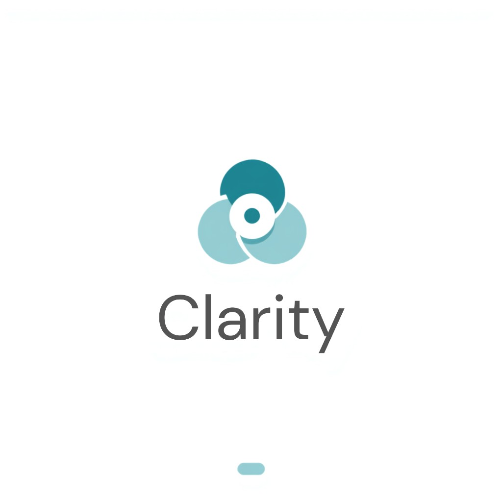

<p align="center">
  
</p>

# CLARITY

**A unified corporate workspace** for tasks, team chat, embedded video meetings, GitHub activity, and AI meeting recaps — built so decisions from a call become a reviewed summary the team can act on without another meeting.

Portfolio full-stack project by [Kgothatso Mokgashi](https://github.com/LORDE01V).

## Why it exists

Teams bounce between Jira, Slack/Teams, Zoom/Meet, and GitHub. Clarity keeps day-to-day work in one workspace and closes the loop after meetings:

**meet → transcript (Whisper) → AI draft recap → human review → send to team chat**

## What’s built

| Area | What you get |
|------|----------------|
| **Auth & orgs** | Supabase Auth, org create, default General team, invites + RBAC (Owner / PM / Member / Guest) |
| **Tasks** | Kanban board (create, move, assign, due dates) against live Supabase |
| **Chat** | Team channels (`#general`), **1:1 DMs**, and **group** chats — membership-scoped |
| **GitHub** | GitHub App connect, webhook ingest, activity feed (link work with `CLR-###` in PR/issue titles) |
| **Meetings** | **New meeting** auto-creates a unique [Jitsi](https://meet.jit.si) room and embeds it in the dashboard |
| **AI recaps** | Paste notes or upload audio → **OpenAI Whisper** transcript → **GPT-4o-mini** summary + action items → edit → post to `#general` |

## Tech stack

| Layer | Choice |
|-------|--------|
| Frontend | React + TypeScript + Vite + Tailwind |
| Backend | FastAPI (Python) |
| DB / Auth | Supabase (Postgres + Auth) |
| Video | Public Jitsi Meet (`meet.jit.si`) — no Jitsi account required |
| AI | OpenAI (`whisper-1` + `gpt-4o-mini`) |
| Code sync | GitHub App + webhooks |
| CI | GitHub Actions |

Deploy targets (when you’re ready): API on Render (or similar), frontend on Cloudflare Pages / Vercel — same env vars as local.

## Architecture (high level)

```
React (Vite) ──JWT──> FastAPI ──service_role──> Supabase Postgres
                         │
                         ├── Jitsi room URLs (embed in UI)
                         ├── OpenAI Whisper (audio → transcript)
                         ├── OpenAI chat (transcript → recap draft)
                         └── GitHub App (webhooks → activity / task links)
```

## Roles

- **Owner** — org-wide; creates teams  
- **Project Manager** — invites, assigns, manages team work  
- **Member** — tasks, chat, meetings, recaps  
- **Guest** — read-scoped access where granted  

## Branches

| Branch | Contents |
|--------|----------|
| `Backend` | FastAPI app, migrations, tests |
| `Frontend` | React app |
| `main` | Merge when you’ve smoke-tested and approve |

## Local setup

### 1. Backend

```bash
cd backend
python -m venv venv
# Windows: venv\Scripts\activate
# macOS/Linux: source venv/bin/activate
pip install -r requirements.txt
copy .env.example .env   # or: cp .env.example .env
```

Fill `backend/.env` (never commit it):

| Variable | Purpose |
|----------|---------|
| `SUPABASE_URL`, `SUPABASE_ANON_KEY`, `SUPABASE_SERVICE_ROLE_KEY`, `SUPABASE_JWT_SECRET` | Auth + DB |
| `CORS_ORIGINS` | Include `http://127.0.0.1:5173` and `http://localhost:5173` |
| `OPENAI_API_KEY` | Whisper + recaps |
| `OPENAI_MODEL` | Default `gpt-4o-mini` |
| `OPENAI_WHISPER_MODEL` | Default `whisper-1` |
| `JITSI_BASE_URL` | Default `https://meet.jit.si` |
| `GITHUB_*` | App id, slug, webhook secret, private key path (for Connect GitHub) |
| `FRONTEND_ORIGIN` | e.g. `http://localhost:5173` |

```bash
uvicorn app.main:app --reload --host 127.0.0.1 --port 8001
```

### 2. Frontend

```bash
cd frontend
npm install
copy .env.example .env   # or: cp .env.example .env
```

| Variable | Example |
|----------|---------|
| `VITE_SUPABASE_URL` | same project URL |
| `VITE_SUPABASE_ANON_KEY` | anon key |
| `VITE_API_BASE_URL` | `http://127.0.0.1:8001/api/v1` |
| `VITE_AUTH_BYPASS` | `false` for live auth |

```bash
npm run dev
```

Open `http://127.0.0.1:5173`.

### 3. Supabase migrations

In the Supabase **SQL Editor**, run in order:

1. `001_initial_schema.sql`  
2. `002_tasks.sql`  
3. `003_task_due_date.sql`  
4. `004_chat.sql`  
5. `005_chat_dms_groups.sql`  
6. `006_meeting_recaps.sql`  
7. `007_meetings.sql`  

Turn **Confirm email** off under Auth settings if you want local register → session without mailbox.

### 4. GitHub webhooks (local)

Point the App webhook at a [Smee](https://smee.io) channel, then:

```bash
npx smee-client -u https://smee.io/YOUR_CHANNEL -t http://127.0.0.1:8001/api/v1/github/webhooks
```

On deploy, set the webhook URL to your **public** API (`…/api/v1/github/webhooks`) instead of Smee.

## Demo path (smoke)

1. Register / login → create organization  
2. **Tasks** — create a card and move columns  
3. **Code** — Connect GitHub (optional)  
4. **Chat** — `#general`, DM, or group  
5. **New meeting** — join embedded Jitsi → upload short audio or paste notes → AI recap → send to chat  

## Honest limits (portfolio)

- Public Jitsi does **not** auto-push recordings into Clarity; upload/paste → Whisper is intentional.  
- Chat uses **polling** (not websockets) for new messages.  
- AI uses **your** OpenAI key (not free HF inference).  

## Deploy (Render — API)

Blueprint file: [`render.yaml`](render.yaml) (free web service).

1. Push the `Backend` branch (already contains the API).
2. In [Render](https://dashboard.render.com/) → **New** → **Blueprint** (or **Web Service**).
3. Connect `LORDE01V/CLARITY`, branch **`Backend`**, root directory **`backend`**.
4. Build: `pip install -r requirements.txt`  
   Start: `uvicorn app.main:app --host 0.0.0.0 --port $PORT`  
   Health check: `/health`
5. Add environment variables (same names as `backend/.env.example`):
   - Supabase: `SUPABASE_URL`, `SUPABASE_ANON_KEY`, `SUPABASE_SERVICE_ROLE_KEY`, `SUPABASE_JWT_SECRET`
   - `APP_ENV=production`
   - `CORS_ORIGINS` — include localhost for now; add your frontend URL after FE deploy
   - `FRONTEND_ORIGIN` — same as your FE origin when ready
   - `OPENAI_API_KEY`, `OPENAI_MODEL=gpt-4o-mini`
   - GitHub (optional at first): paste PEM into `GITHUB_PRIVATE_KEY` (not a file path)
6. Deploy → open `https://YOUR_SERVICE.onrender.com/health` (should return `ok`).
7. Point the GitHub App webhook to:  
   `https://YOUR_SERVICE.onrender.com/api/v1/github/webhooks`

Free tier spins down after idle; first request can take ~30–60s.

## License

[MIT](LICENSE)
